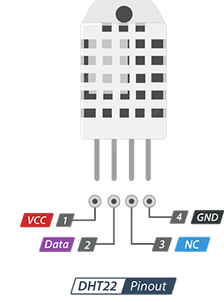

# Digital Green House

# Objectives:

1.To control temperature inside Green House.

2.To control humidity inside Green House.

3.Control water moisture in the Green House soil.

4.Use water pump to water according to soil moisture.

5.Whole System is Automated from Arduino.

# Introduction:

This greenhouse system has different sensors to measure the ambient temperature,humidity, the soil
moisture.
The ambient temperature sensor allows us to start the fan and to drive a motor controlled fan to start
when the internal temperature is above the temperature setpoint. Conversely, if the temperature
descends under the temperature setpoint, the fan is stopped. Furthermore, a Bulb is switched on to
control humidity inside the green house. The soil moisture sensor allows to drive a pump and an
electrovalve for the watering system when the earth is too dry.The pump is also stopped when the soil
moisture crosses the soil moisture set point.
In this project we have used the sensors below:

1.DHT- 22

2.Soil Moisture Sensor

## DHT-22:

The casing is in two parts so to get inside it is just a matter of getting a sharp knife and splitting the case
apart. Inside the case, on the sensing side, there is a humidity sensing component along with a NTC
temperature sensor (or thermistor). Humidity sensing component is used, of course to measure
humidity, which has two electrodes with moisture holding substrate (usually a salt or conductive plastic
polymer) sandwiched between them. The ions are released by the substrate as water vapor is absorbed
by it, which in turn increases the conductivity between the electrodes. The change in resistance
between the two electrodes is proportional to the relative humidity. Higher relative humidity decreases
the resistance between the electrodes, while lower relative humidity increases the resistance between
the electrodes. Besides, they consist of a NTC temperature sensor/Thermistor to measure temperature.
A thermistor is a thermal resistor – a resistor that changes its resistance with temperature. Technically,
all resistors are thermistors – their resistance changes slightly with temperature – but the change is
usually very very small and difficult to measure.

Thermistors are made so that the resistance changes drastically with temperature so that it can be 100
ohms or more of change per degree! The term “NTC” means “Negative Temperature Coefficient”, which
means that the resistance decreases with increase of the temperature. On the other side, there is a
small PCB with an 8-bit SOIC-14 packaged IC. This IC measures and processes the analog signal with
stored calibration coefficients, does analog to digital conversion and spits out a digital signal with the
temperature and humidity.

      Fig: DHT-22 pinout

## Soil Moisture Sensor :

The Moisture sensor is used to measure the water content(moisture) of soil.when the soil is having
water shortage,the module output is at high level, else the output is at low level.This sensor reminds the
user to water their plants and also monitors the moisture content of soil.It has been widely used in
agriculture,land irrigation and botanical gardening.

The Soil Moisture Sensor uses capacitance to measure dielectric permittivity of the surrounding
medium. In soil, dielectric permittivity is a function of the water content. The sensor creates a voltage
proportional to the dielectric permittivity, and therefore the water content of the soil. The sensor
averages the water content over the entire length of the sensor. There is a 2 cm zone of influence with
respect to the flat surface of the sensor, but it has little or no sensitivity at the extreme edges.The Soil
Moisture Sensor is used to measure the loss of moisture over time due to evaporation and plant
uptake,evaluate optimum soil moisture contents for various species of plants,monitor soil moisture
content to control irrigation in greenhouses and enhance bottle biology experiments.

       Fig:Soil Moisture Sensor

# Components Required:

1.Arduino Mega 2560

2.DHT22 sensor

3.Soil Moisture Sensor

4.16*2 LCD Display

5.Relay Modules

6.12 Volt Water Pump

7.4 Volt Motor

8.60 watt bulb

8.Potentiometer

9.BreadBoard

10.Wires

# Discussion:

In this project we have achieved to delevop a system to automate a green house.It was very difficult to
work with many sensors and peripherals.We have faced problem with wiring.We had to use firm wiring
with sensors to get the accurate value.The soil moisture sensor had to be calibrated first to achieve
precision value.To show the data in a lcd display was a major task as it was very delicate and real time
data.

